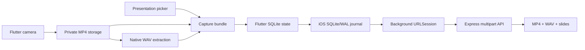

# Presentation Capture

An iPhone-first, self-hosted Flutter app for recording presentations, attaching slides, extracting WAV audio, and reliably uploading the complete capture bundle to a Linux server.


## Highlights

- Rear-camera recording with microphone audio in portrait or landscape orientation
- 720p, 1080p, and 4K presets with automatic fallback on unsupported devices
- Pause and resume within a single MP4 recording
- Required `.ppt`, `.pptx`, or `.pdf` presentation attachment
- Native iOS extraction to uncompressed 48 kHz, 16-bit mono WAV
- App-private local storage with playback, upload progress, and deletion controls
- Resumable 16 MiB multipart uploads backed by SQLite and SHA-256 verification
- Native iOS background uploads that recover after suspension, network loss, or process reclamation
- Google Sign-In with server-side ID-token verification
- English and Simplified Chinese interfaces

## Capture bundle

Each completed recording produces one server-side directory:

| File | Purpose |
| --- | --- |
| `final.mp4` | Presentation video with microphone audio |
| `audio.wav` | Extracted mono WAV audio |
| `presentation.ppt`, `.pptx`, or `.pdf` | Slides selected by the user |

Recordings remain in the app's private directory and are never copied to iPhone Photos.

## Architecture



The server's completed-parts response is authoritative. After a restart or interruption, the app reconciles Flutter SQLite state, the native upload journal, active iOS tasks, and server state before scheduling missing parts. Only three temporary chunks are staged at once, so a large 4K recording does not require a second full video copy.

## Technology

| Layer | Stack |
| --- | --- |
| Mobile UI and application state | Flutter, Dart, SQLite |
| Recording and media processing | Flutter Camera, AVFoundation |
| Durable background transfer | Swift, background `URLSession`, SQLite/WAL |
| Upload API | Node.js, Express |
| Deployment | Docker Compose, optional Nginx/Caddy reverse proxy |

## Quick start

### Requirements

- Flutter stable
- Xcode with iOS 16 SDK or later
- Node.js 22 or Docker Desktop

Clone the repository and prepare the app:

```bash
git clone https://github.com/JaspinXu/presentation-capture.git
cd presentation-capture
flutter config --enable-swift-package-manager
flutter pub get
```

Start the local upload server:

```bash
cd server
docker compose up --build
```

Then run the app from the repository root:

```bash
flutter run
```

Use `http://localhost:8080` in the iOS Simulator. A physical iPhone must use the computer's LAN address, for example `http://192.168.1.20:8080`, because `localhost` on the phone refers to the phone itself.

## Authentication

Google Sign-In is the only user-facing authentication method. OAuth credentials are intentionally excluded from Git.

1. Create a Google OAuth iOS client for your bundle identifier.
2. Copy `ios/Flutter/GoogleAuth.xcconfig.example` to `ios/Flutter/GoogleAuth.xcconfig`.
3. Add the iOS client ID, backend/web client ID, and reversed iOS client ID.
4. Set `GOOGLE_CLIENT_IDS` on the server to the backend/web client ID.

The default identifiers are `com.jaspinxu.presentationcapture.dev` for Debug and `com.jaspinxu.presentationcapture` for Release. Change them before distributing your own build.

The password endpoint and `demo@example.com` / `demo1234` credentials exist only for automated server tests and are not exposed in the app UI. Disable demo login in production.

## Verification

On macOS, run the complete validation script:

```bash
./tool/verify_macos.sh
```

It runs Flutter dependency resolution, static analysis, tests, and an unsigned iOS Simulator build. Server tests can be run separately:

```bash
cd server
npm install
npm test
```

For detailed setup and physical-device checks, see [Mac and iPhone setup (Chinese)](docs/MAC_IOS_SETUP_ZH.md). Simulator builds cannot validate camera capture, microphone quality, real 4K encoding, thermal behavior, or background uploads under lock-screen and network-switch conditions.

## Production deployment

Copy the production environment template and provide your own secret, OAuth client ID, host data directory, and service UID/GID:

```bash
cd server
cp .env.production.example .env.production
docker compose --env-file .env.production \
  -f docker-compose.production.yml up --build -d
```

The service binds to `127.0.0.1:8080` by default. Put it behind an HTTPS reverse proxy before exposing it publicly, keep secrets outside Git, and remove iOS `NSAllowsArbitraryLoads` once HTTPS is configured. See [generic Linux deployment (Chinese)](docs/LINUX_SERVER_DEPLOYMENT_ZH.md) for a complete walkthrough.

Before broader deployment, define storage quotas, retention, backups, monitoring, rate limits, audit logging, and user lifecycle policies.

## Project structure

```text
lib/                 Flutter UI, models, services, and upload state machine
ios/Runner/          iOS host, media processing, and background upload engine
server/              Express multipart upload API and Docker deployment
docs/                macOS/iPhone setup and Linux deployment guides
test/                Flutter unit and widget tests
tool/                local verification scripts
```

## Scope

The current priority is iOS. This project intentionally excludes editing, filters, beauty effects, AR, pose, IMU, depth, point clouds, meshes, and MCAP output.
